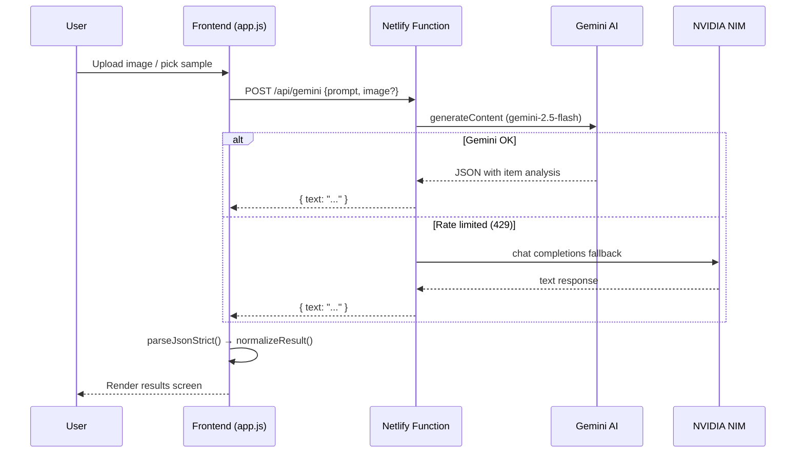

<div align="center">

<!-- Animated Banner -->


<!-- Badges Row 1 -->
<p>
  
  
  
</p>

<!-- Badges Row 2 -->
<p>
  
  
  
</p>

<br/>

<!-- Hero tagline -->
<h3>
  ♻️ &nbsp; <em>Scan it. Save it. Reinvent it.</em>
</h3>

<p>
  EcoScan is an <strong>AI-powered waste intelligence platform</strong> that instantly identifies any waste item from an image or description, computes its real environmental footprint, and generates step-by-step upcycle projects you can actually build — all powered by <strong>Google Gemini</strong>.
</p>

<br/>

<!-- Live Demo Button -->
<a href="https://capable-fox-d3cd15.netlify.app" target="_blank">
  
</a>

<br/><br/>

</div>

---

## ✨ Features at a Glance

<div align="center">

| Feature | Description |
|:---|:---|
| 🔍 **AI Waste Scanner** | Upload a photo or pick a sample — Gemini identifies the item, its waste type, recyclability & CO₂ savings in seconds |
| 🧪 **Material Breakdown** | 4–6 material layers with percentage bars, toxicity flags, and recoverability scores |
| 💡 **3 Upcycle Ideas** | Step-by-step DIY projects per scan, filterable by Easy / Medium / Hard difficulty |
| 🗺️ **Global Heatmap** | Leaflet.js live heatmap plotting every scan you do on a real world map |
| 🏆 **CO₂ Leaderboard** | Top 5 highest-impact saves ranked per session |
| 🔥 **Streak Tracker** | Daily eco-streak — keeps you coming back |
| 📜 **Scan History** | All-time scan log stored locally, with full impact stats |
| 📍 **Smart Disposal** | One-tap to open Google Maps to find drop-off centres near you |
| 💾 **Downloadable Report** | One-click download of a structured scan report for any item |

</div>

---

## 🏗️ Architecture

```
┌────────────────────────────────────────────────────┐
│                      Browser                       │
│  ┌──────────┐  ┌──────────┐  ┌──────────────────┐  │
│  │index.html│  │styles.css│  │    app.js (SPA)  │  │
│  └──────────┘  └──────────┘  └────────┬─────────┘  │
└───────────────────────────────────────┼────────────┘
                                        │ POST /api/gemini
                            ┌───────────▼────────────┐
                            │   Netlify Functions     │
                            │  netlify/functions/     │
                            │  └─ gemini.js           │
                            └───────────┬────────────┘
                               ┌────────┴───────────┐
                               │                    │
                   ┌───────────▼──────┐  ┌──────────▼────────┐
                   │  Google Gemini   │  │   NVIDIA NIM       │
                   │  (Primary AI)    │  │  (Fallback on 429) │
                   └──────────────────┘  └───────────────────┘
```

- **Frontend** — Pure HTML, CSS & vanilla JS single-page app, zero dependencies bundled
- **Serverless Backend** — One Netlify Function per route (`/api/gemini`, `/api/health`)
- **AI layer** — Gemini 2.5 Flash as primary; auto-falls back to NVIDIA NIM on rate-limit
- **Map layer** — Leaflet.js + Leaflet.heat, all data stored in `localStorage` (never a server)

---

## 🚀 Quick Start (Local)

### Prerequisites
- **Node.js 18+** — built-in `fetch` required
- A **Google Gemini API key** — [Get one free](https://aistudio.google.com/app/apikey)

### 1. Clone

```bash
git clone https://github.com/Sarthak221105/Ecoscan.git
cd Ecoscan
```

### 2. Configure Environment

```bash
cd backend
cp .env.example .env
```

Open `backend/.env` and fill in:

```env
GEMINI_API_KEY=your_gemini_api_key_here
GEMINI_MODEL=gemini-2.5-flash         # optional, this is the default
NVIDIA_API_KEY=your_nvidia_key_here   # optional fallback
NVIDIA_MODEL=google/gemma-4-31b-it    # optional fallback model
PORT=3000
```

### 3. Install & Run

```bash
npm install
npm start
```

### 4. Open

```
http://localhost:3000
```

> **Tip:** The frontend is served directly by the Express server — no separate `npm` command needed.

---

## ☁️ Deployment (Netlify)

The repo ships with a ready-made `netlify.toml`. All you need to do is:

### Option A — Netlify CLI (Recommended)

```bash
npm install -g netlify-cli   # once

netlify link                 # link to your Netlify site
netlify env:set GEMINI_API_KEY your_key_here
netlify deploy --prod
```

### Option B — Netlify Dashboard

1. Push this repo to GitHub
2. Go to **Netlify → Add new site → Import from Git**
3. Choose this repo — Netlify auto-detects `netlify.toml`
4. Under **Site configuration → Environment variables** add:

| Key | Value |
|---|---|
| `GEMINI_API_KEY` | *(your Gemini key)* |
| `GEMINI_MODEL` | `gemini-2.5-flash` |
| `NVIDIA_API_KEY` | *(optional fallback)* |

5. Click **Deploy** — your app is live ✅

---

## 📁 Project Structure

```
Ecoscan/
├── frontend/                 # Pure static SPA (zero build step)
│   ├── index.html            # App shell & all screen markup
│   ├── styles.css            # Complete design system — dark mode, glassmorphism, animations
│   └── app.js                # 1000-line SPA engine — scan, map, history, results
│
├── netlify/
│   └── functions/            # Serverless API (replaces Express on Netlify)
│       ├── gemini.js         # POST /api/gemini — proxies Gemini + NVIDIA fallback
│       └── health.js         # GET  /api/health — uptime check
│
├── backend/                  # Local dev Express server (equivalent of above)
│   ├── server.js             # Express + Gemini proxy + NVIDIA fallback
│   ├── package.json
│   └── .env.example          # Template for required env vars
│
├── netlify.toml              # Netlify build + redirect config
├── .gitignore
└── README.md
```

---

## 🤖 How the AI Works



**Two-pass scan strategy:**
1. **Primary pass** — full waste analysis (item, type, CO₂, 3 upcycle ideas, disposal tip, fun fact)
2. **Material pass** — parallel call for composition breakdown (4–6 materials, toxicity, recoverability)

---

## 🎨 Design System

EcoScan uses a rich, custom dark-mode design system with:

- **Colour palette** — `#34d399` emerald · `#60a5fa` blue · `#a78bfa` violet · deep `#0a0e1a` background
- **Glassmorphism cards** — frosted-glass panels with `backdrop-filter: blur()`
- **Gradient typography** — animated `linear-gradient` on hero text
- **Micro-animations** — fade-in screens, spinner arcs, progress bar counters, material bar slide-ins
- **Live heatmap** — gradient `#1e40af → #06b6d4 → #84cc16 → #facc15 → #f97316 → #ef4444`
- **Toast system** — contextual success / error / info toasts with auto-dismiss

---

## 🌍 Waste Types Supported

| Badge | Type | Examples |
|:---:|:---|:---|
| 🟢 | **Plastic** | Bottles, bags, packaging |
| 🟤 | **Organic** | Food scraps, plant matter |
| ⚙️ | **Metal** | Tin cans, aluminium foil |
| ⚡ | **E-Waste** | Batteries, electronics |
| 📄 | **Paper** | Cardboard, newspapers |
| 🫙 | **Glass** | Jars, bottles |
| ⬛ | **General** | Everything else |

---

## 🔒 Privacy & Security

- **API key never exposed** — Gemini key lives only in server-side environment variables; the browser never sees it
- **All user data stays local** — Scan history, location, and streaks are stored in `localStorage` only; nothing is sent to any database
- **Location is optional** — The heatmap works without location; it's requested only if you choose to enable it

---

## 🛣️ Roadmap

- [ ] Camera capture (live scan from device camera)
- [ ] PWA / offline support
- [ ] Multi-item batch scanning
- [ ] Community leaderboard (shared across users)
- [ ] Recycling centre directory API integration
- [ ] Export scan history as CSV

---

## 🤝 Contributing

Pull requests are welcome! Please:

1. Fork the repo
2. Create a feature branch: `git checkout -b feat/your-feature`
3. Commit your changes: `git commit -m 'feat: add amazing feature'`
4. Push and open a PR

---

## 📄 License

Distributed under the **MIT License**. See [`LICENSE`](LICENSE) for details.

---

<div align="center">


**Built with ♻️ for a circular future**

⭐ Star this repo if EcoScan helped you think differently about waste!

[](https://github.com/Sarthak221105/Ecoscan/stargazers)
[](https://github.com/Sarthak221105/Ecoscan/network/members)

</div>
